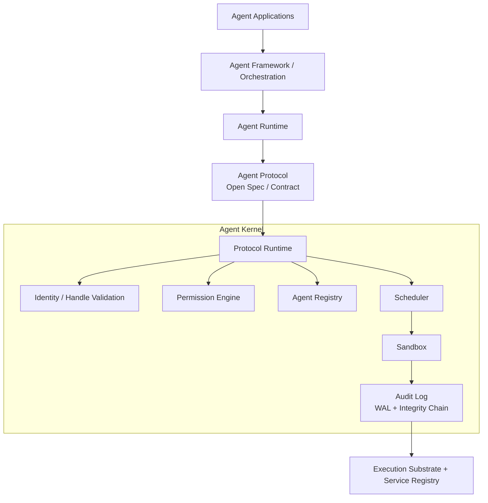
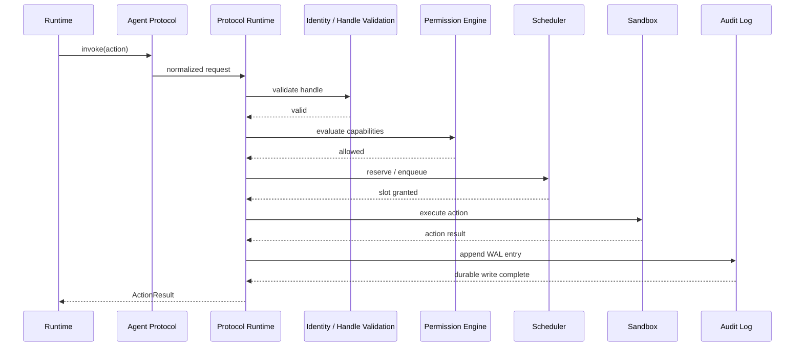

# Kernel + Protocol Architecture Refresh Implementation Plan

> **For agentic workers:** REQUIRED SUB-SKILL: Use superpowers:subagent-driven-development (recommended) or superpowers:executing-plans to implement this plan task-by-task. Steps use checkbox (`- [ ]`) syntax for tracking.

**Goal:** Update the repository's internal architecture materials so they consistently present Agent Protocol as both an open contract and an embedded Kernel module, while preserving the Framework/Runtime split and clarifying Agent-to-Agent governance.

**Architecture:** Treat this as a documentation-and-diagram refresh, not a code implementation project. The work should create source-controlled architecture diagram assets, align the top-level architecture narrative with the approved internal design, and keep the review surface small and internally consistent.

**Tech Stack:** Markdown, Mermaid text diagrams, repository documentation files, shell validation with `rg`, `sed`, and `git diff`

---

## File Structure

Planned file ownership for this work:

- Create: `docs/architecture/diagrams/kernel-protocol-main.mmd`
  Responsibility: source of truth for the main internal layered architecture diagram.
- Create: `docs/architecture/diagrams/kernel-protocol-a2a.mmd`
  Responsibility: source of truth for the Agent-to-Agent governance sub-diagram.
- Create: `docs/architecture/diagrams/kernel-protocol-invoke-sequence.mmd`
  Responsibility: optional but recommended dynamic invocation-path sequence diagram.
- Modify: `docs/architecture/2026-03-25-kernel-protocol-architecture.md`
  Responsibility: approved internal design note; add links to final diagram sources if needed.
- Modify: `ARCHITECTURE.md`
  Responsibility: public architecture narrative; align terminology and system-model description with the approved internal structure where appropriate.
- Modify: `README.md`
  Responsibility: provide a visible pointer to the architecture note and diagram set.

Out of scope for this plan:

- Rust crate creation
- Protocol implementation
- Updating repository layout claims in `AGENTS.md`
- Binary image editing workflows for `arch.PNG`

### Task 1: Create source-controlled architecture diagram assets

**Files:**
- Create: `docs/architecture/diagrams/kernel-protocol-main.mmd`
- Create: `docs/architecture/diagrams/kernel-protocol-a2a.mmd`
- Create: `docs/architecture/diagrams/kernel-protocol-invoke-sequence.mmd`
- Modify: `docs/architecture/2026-03-25-kernel-protocol-architecture.md`

- [ ] **Step 1: Create the diagrams directory**

Run: `mkdir -p docs/architecture/diagrams`
Expected: command exits successfully with no output

- [ ] **Step 2: Write the main layered diagram source**

Create `docs/architecture/diagrams/kernel-protocol-main.mmd` with a Mermaid flowchart that includes:



- [ ] **Step 3: Write the Agent-to-Agent governance diagram source**

Create `docs/architecture/diagrams/kernel-protocol-a2a.mmd` with a Mermaid flowchart that shows:

```mermaid
flowchart TD
    a[Agent A<br/>caller handle + caller caps]
    call[CallAgent(target_id, payload, caps_hint?)]

    subgraph invoke[Kernel invoke path]
        v1[1. validate caller handle]
        v2[2. lookup target agent]
        v3[3. delegated_caps = caller ∩ target]
        v4[4. create child span]
        v5[5. preserve run_id + set parent_span_id]
        v6[6. write audit log entry]
        v7[7. dispatch child invocation]
    end

    b[Agent B<br/>executes with delegated_caps only]

    a --> call --> v1 --> v2 --> v3 --> v4 --> v5 --> v6 --> v7 --> b
```

- [ ] **Step 4: Write the invocation sequence diagram source**

Create `docs/architecture/diagrams/kernel-protocol-invoke-sequence.mmd` with a Mermaid sequence diagram that shows:



- [ ] **Step 5: Link the new diagram assets from the architecture note**

Update `docs/architecture/2026-03-25-kernel-protocol-architecture.md` to add a short section such as:

```md
## Diagram Sources

- `docs/architecture/diagrams/kernel-protocol-main.mmd`
- `docs/architecture/diagrams/kernel-protocol-a2a.mmd`
- `docs/architecture/diagrams/kernel-protocol-invoke-sequence.mmd`
```

- [ ] **Step 6: Verify the new files exist and use the expected labels**

Run: `rg -n "Protocol Runtime|Identity / Handle Validation|caller ∩ target|durable write complete" docs/architecture/diagrams docs/architecture/2026-03-25-kernel-protocol-architecture.md`
Expected: matching lines from the three Mermaid files and the architecture note

- [ ] **Step 7: Commit Task 1**

Run:

```bash
git add docs/architecture/diagrams docs/architecture/2026-03-25-kernel-protocol-architecture.md
git commit -m "docs: add kernel protocol architecture diagram sources"
```

Expected: one commit containing the new Mermaid sources and note updates

### Task 2: Align `ARCHITECTURE.md` with the approved internal design

**Files:**
- Modify: `ARCHITECTURE.md`
- Reference: `docs/architecture/2026-03-25-kernel-protocol-architecture.md`

- [ ] **Step 1: Update the system model section to reflect the approved layering**

Replace the current ASCII diagram in `ARCHITECTURE.md` with a version that:

- keeps `Framework / Orchestration` and `Agent Runtime` as separate layers
- shows `Agent Protocol` as an external contract layer
- shows `Protocol Runtime` embedded inside `Agent Kernel`
- includes `Identity / Handle Validation` or at least mentions it in the surrounding prose

- [ ] **Step 2: Tighten the Protocol/Kernel relationship language**

Update the `Relationship between Protocol and Kernel` wording so it states both:

- the Protocol is an open, implementation-independent standard
- the Kernel product contains a concrete `Protocol Runtime` implementing that standard

Use wording consistent with the approved architecture note rather than inventing new terminology.

- [ ] **Step 3: Add a short internal consistency note around the critical path**

Add one concise sentence near the system-model or integration section making this explicit:

`All externally meaningful actions enter through invoke and do not become observable before required audit persistence completes.`

- [ ] **Step 4: Verify the document still avoids overclaiming current repository contents**

Run: `rg -n "Protocol Runtime|Open Spec / Contract|invoke|audit persistence" ARCHITECTURE.md`
Expected: updated wording appears in the intended sections

- [ ] **Step 5: Review the diff for terminology drift**

Run: `git diff -- ARCHITECTURE.md`
Expected: only architecture wording and diagram updates, no unrelated edits

- [ ] **Step 6: Commit Task 2**

Run:

```bash
git add ARCHITECTURE.md
git commit -m "docs: align architecture narrative with kernel protocol design"
```

Expected: one focused documentation commit

### Task 3: Add discoverability from the repository entry point

**Files:**
- Modify: `README.md`
- Reference: `ARCHITECTURE.md`
- Reference: `docs/architecture/2026-03-25-kernel-protocol-architecture.md`

- [ ] **Step 1: Expand the README beyond the current single-line placeholder**

Replace the current contents with a minimal internal-facing index such as:

```md
# aces

Internal architecture working repository for Agent Kernel and Agent Protocol design materials.

## Key documents

- `ARCHITECTURE.md`
- `AGENTS.md`
- `protocol-spec/overview.md`
- `docs/architecture/2026-03-25-kernel-protocol-architecture.md`
```

- [ ] **Step 2: Add a short sentence describing the new diagram sources**

Include one line pointing readers to `docs/architecture/diagrams/` as the source-controlled diagram location.

- [ ] **Step 3: Verify the README links the right documents**

Run: `sed -n '1,80p' README.md`
Expected: a short index with the architecture note and diagram directory called out explicitly

- [ ] **Step 4: Commit Task 3**

Run:

```bash
git add README.md
git commit -m "docs: add architecture entry points to readme"
```

Expected: one small commit focused on discoverability

### Task 4: Final verification and review handoff

**Files:**
- Verify: `README.md`
- Verify: `ARCHITECTURE.md`
- Verify: `docs/architecture/2026-03-25-kernel-protocol-architecture.md`
- Verify: `docs/architecture/diagrams/kernel-protocol-main.mmd`
- Verify: `docs/architecture/diagrams/kernel-protocol-a2a.mmd`
- Verify: `docs/architecture/diagrams/kernel-protocol-invoke-sequence.mmd`

- [ ] **Step 1: Run a repository-wide terminology check**

Run: `rg -n "Identity & Auth|Protocol Runtime|Open Spec / Contract|delegated_caps|parent_span_id" README.md ARCHITECTURE.md docs/architecture`
Expected: new terminology appears where intended; old `Identity & Auth` sidebar framing is absent from the refreshed materials

- [ ] **Step 2: Review the combined diff**

Run: `git diff -- README.md ARCHITECTURE.md docs/architecture`
Expected: only documentation and diagram-source changes relevant to the approved design

- [ ] **Step 3: Capture any manual follow-up for the binary image**

Record in the final handoff note whether `arch.PNG` should be deprecated, replaced later, or kept only as a legacy artifact. Do not edit the binary in this plan.

- [ ] **Step 4: Commit final cleanups if needed**

Run:

```bash
git add README.md ARCHITECTURE.md docs/architecture
git commit -m "docs: finalize kernel protocol architecture refresh"
```

Expected: either no-op because previous commits are sufficient, or one final small cleanup commit

- [ ] **Step 5: Prepare execution handoff**

Summarize:

- which files were added
- which files were updated
- how the new diagrams replace ad hoc architecture communication
- whether `arch.PNG` remains temporary or should be retired

## Execution Notes

- Keep this plan scoped to documentation and diagram assets only.
- Prefer Mermaid source files over editing binary image artifacts.
- Do not try to reconcile the entire aspirational repository layout described in `AGENTS.md` as part of this work.
- Keep commits focused and reversible.

## Review Constraint

The `writing-plans` skill recommends a plan-document review loop. In this environment, only use delegated review if the user explicitly asks for subagents. If not, perform a self-review against the approved architecture note before execution.
